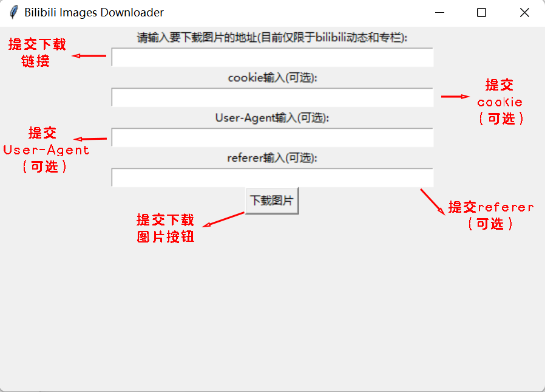

### 这是一个loser做的简单bilibili动态和专栏爬取小程序

#### 下面我简单教一下大家使用方法

1. ##### 首先压缩包下载完后友友们可以看到三个玩意

   

   + resource文件夹是保存图片下载的地方
   + download_pictures.exe是启动文件，各位友友直接点击就能运行了
   + download_pictures.py是源码，有大佬帮我看看就真的万分感谢了

   

2. ##### 点击exe启动后，各位可以看到下图的面板

   

   + 第一个框是用来提交图片下载链接地址的（是网页链接、网页链接、网页链接！！！）
   + 剩余的三个框是可填选项，感兴趣的友友可以到文档最后了解
   + 最后是下载图片按钮（一定要复制完链接后再点击喔）

3. ##### 接下来复制链接粘贴到第一个输入框后，点击下载图片按钮等待下载完成

   

4. ##### 完成下载后，请前往resource文件查看是否下载成功

   

   + 每下载一次resource文件就会多出一个download文件夹，请点开文件夹查看是否下载成功

5. ##### 下载成功案例

   

6. ##### 一些问题，希望友友们能注意一下

   + 理论上友友们只用提交下载链接就行，但我害怕偶然事件，所以如果各位下载不成功，可以看一下文档最后的内容
   + 因为鄙人现在技术力有限，部分网站的图片可能不能成功下载，如果各位发现部分网页的图片爬取失败，请及时反馈给我，谢谢

### 附加内容（可不看）

#### 如何获取cookie、referer、user-agent

1. ##### 打开需要下载的网页

   

   

2. ##### 鼠标右键后点击检查

   ##### 

3. 步骤有点多，请直接看下图	

   

   + 首先点击检查后一般会什么都看不见，请点击刷新
   + 点击刷新后会看到一堆东西冒出，请不用管，点击NetWork
   + 在输入框输入main
   + 点击main开头的请求

4. 请点击Request Headers，你会看到Cookie、Referer、User-Agent

   

### 未来待解决的问题

1. 如何解决ajax异步加载网页的爬取，部分网页获取下来的html内容并没有包含img标签，而是通过js去请求别的网址进行渲染，现在我不知道如何对oid，w_rid的参数进行解密，希望有大佬能帮忙指点一下
2. background暂时无法进行爬取，目前仅针对img标签
3. 目前仅仅只在几台Windows10、11系统的设备上测试过，其它环境尚不知结果，如果有友友发现问题，麻烦及时告诉我

